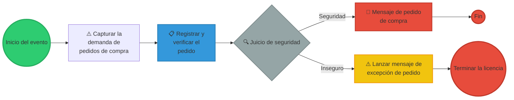
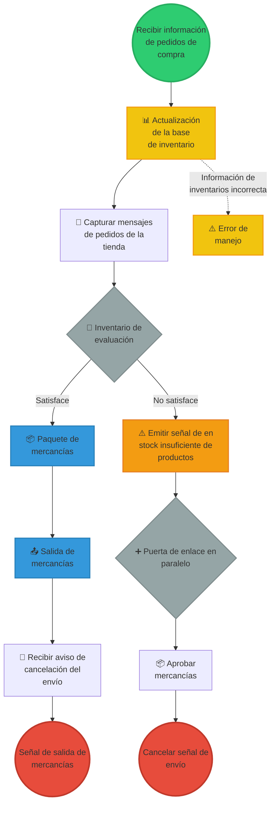
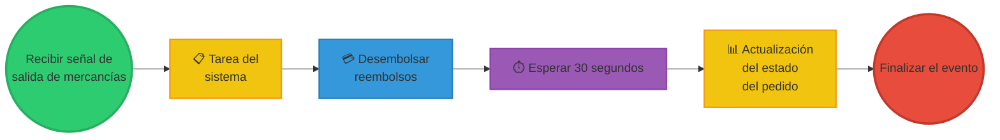
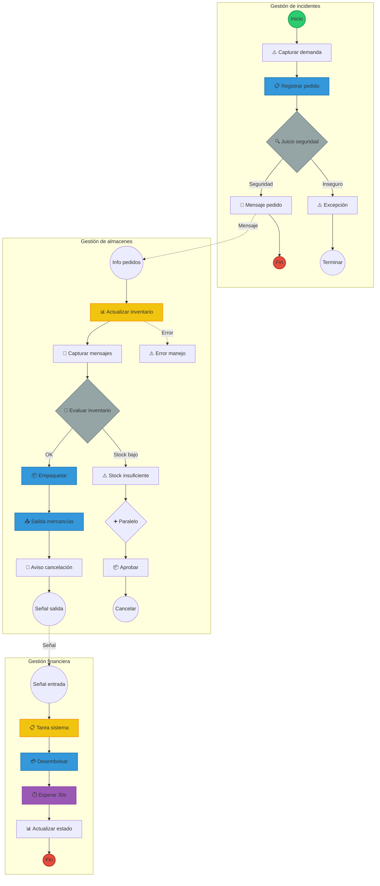

# 📊 Modelo BPMN - Proceso de Compra de Mercancías

Este documento contiene los diagramas BPMN del proceso de compra de mercancías, modelados según el ejemplo de la Clínica Salud Viva y adaptado a un proceso de gestión de inventarios y compras.

---

## 🔄 Proceso completo: Gestión de Compra de Mercancías

El siguiente diagrama muestra el proceso completo dividido en tres carriles (swimlanes):
1. **Gestión de incidentes** - Manejo de pedidos de compra con validaciones de seguridad
2. **Proceso de compra de mercancías** - Flujo principal de compra con gestión de inventarios
3. **Gestión financiera** - Procesamiento de pagos y actualización de estados

---

## 📍 Diagrama 1: Gestión de Incidentes

Este proceso maneja la recepción y validación de pedidos de compra.

**Elementos del proceso:**
- **Evento de inicio**: Captura de la demanda de pedidos
- **Tarea manual**: Registro y verificación del pedido
- **Gateway exclusivo**: Validación de seguridad
- **Eventos de mensaje**: Comunicación de resultados
- **Eventos de fin**: Finalización del proceso

---

## 📦 Diagrama 2: Proceso de Compra de Mercancías

Este es el proceso central que gestiona el inventario y las órdenes de compra.

**Elementos clave:**
- **Actualización de inventario**: Tarea automatizada con validación de datos
- **Gateway de decisión**: Evaluación de disponibilidad de inventario
- **Tareas de envío**: Empaquetado y salida de mercancías
- **Gateway paralelo**: Manejo de procesos concurrentes
- **Eventos de error**: Gestión de excepciones

---

## 💰 Diagrama 3: Gestión Financiera

Proceso de finalización con manejo de pagos y actualización de estados.

**Componentes:**
- **Evento de señal**: Recepción de confirmación de envío
- **Tareas de sistema**: Procesamiento automatizado
- **Evento de tiempo**: Espera de 30 segundos para sincronización
- **Actualización de estado**: Registro del pedido completado

---

## 🗺️ Diagrama Integrado: Todos los Procesos en Swimlanes

El siguiente diagrama muestra cómo los tres procesos se integran en un flujo completo:

---

## 📋 Leyenda de Elementos BPMN

| Símbolo | Tipo | Significado | Color |
|---------|------|-------------|-------|
| ⭕ Círculo verde | Evento de inicio | Inicia el proceso | Verde |
| 🔴 Círculo rojo | Evento de fin | Termina el proceso | Rojo |
| 📋 Rectángulo azul | Tarea | Actividad a realizar | Azul |
| 📋 Rectángulo amarillo | Tarea del sistema | Actividad automatizada | Amarillo |
| 💎 Rombo | Gateway exclusivo | Decisión (XOR) | Gris |
| ➕ Rombo con + | Gateway paralelo | Procesos concurrentes | Gris |
| 📧 Sobre | Evento de mensaje | Recepción/envío de mensaje | Rojo |
| ⚠️ Triángulo | Evento de error | Manejo de excepciones | Amarillo |
| ⏱️ Reloj | Evento de tiempo | Temporizador | Morado |

---

## 🎯 Análisis del Proceso

### Actores involucrados:
1. **Sistema de gestión de incidentes**: Valida y registra pedidos
2. **Gestión de almacenes**: Controla inventario y despacho
3. **Sistema financiero**: Procesa pagos y actualizaciones

### Puntos críticos identificados:
- ✅ Validación de seguridad en pedidos
- ✅ Verificación de inventario disponible
- ⚠️ Manejo de errores en actualización de inventario
- ⚠️ Gestión de stock insuficiente

### Decisiones principales:
1. **Juicio de seguridad**: Determina si el pedido es válido
2. **Evaluación de inventario**: Verifica disponibilidad de productos
3. **Gateway paralelo**: Permite procesos concurrentes para eficiencia

---

*Diagrama creado para el Taller 1 de Arquitectura Empresarial - Universidad de La Sabana*
