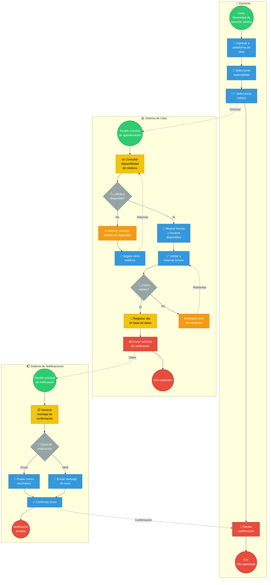

# 📊 Modelo BPMN - Agendamiento de Citas Médicas
## Clínica Salud Viva

Este documento contiene el diagrama BPMN del proceso de agendamiento de citas médicas para la Clínica Salud Viva, modelado según la notación BPMN 2.0.

---

## 🧠 Contexto del Proceso

La Clínica Salud Viva es una institución médica de tamaño medio que ofrece atención presencial y virtual. El proceso de agendamiento permite a los pacientes:
- Seleccionar especialidad médica
- Elegir médico disponible
- Agendar fecha y hora
- Recibir confirmación vía correo/SMS

---

## 🗺️ Diagrama BPMN Completo

### Proceso con Swimlanes (3 Carriles)

---

## 📋 Descripción de Cada Carril

### 1️⃣ Paciente

**Rol**: Usuario que necesita atención médica

**Flujo**:
1. **Inicio**: El paciente identifica la necesidad de atención médica
2. **Ingresar a plataforma**: Accede al sistema de citas en línea
3. **Seleccionar especialidad**: Elige el tipo de atención necesaria (ej: Cardiología, Pediatría)
4. **Seleccionar médico**: Escoge un médico de la lista disponible
5. **Recibir confirmación**: Obtiene notificación de cita agendada
6. **Fin**: Proceso completado con cita confirmada

---

### 2️⃣ Sistema de Citas

**Rol**: Plataforma digital que gestiona agendamientos

**Flujo principal**:
1. **Recibir solicitud**: Captura la petición del paciente
2. **Consultar disponibilidad**: Verifica médicos disponibles en la especialidad
3. **Gateway de decisión - ¿Médico disponible?**:
   - **Sí**: Muestra fechas y horarios disponibles
   - **No**: Muestra mensaje de no disponibilidad y sugiere otros médicos
4. **Validar y reservar**: El paciente selecciona fecha/hora
5. **Gateway de decisión - ¿Datos válidos?**:
   - **Sí**: Registra la cita en la base de datos
   - **No**: Muestra error de validación y permite reintentar
6. **Enviar solicitud de notificación**: Activa el sistema de notificaciones
7. **Fin**: Cita registrada en el sistema

**Manejo de excepciones**:
- Si no hay médicos disponibles → Sugerir alternativas
- Si datos son inválidos → Permitir corrección

---

### 3️⃣ Sistema de Notificaciones

**Rol**: Servicio de comunicación con pacientes

**Flujo**:
1. **Recibir solicitud**: Obtiene datos de la cita confirmada
2. **Generar mensaje**: Crea texto de confirmación con detalles
3. **Gateway de decisión - Canal de notificación**:
   - **Email**: Envía correo electrónico
   - **SMS**: Envía mensaje de texto
4. **Confirmar envío**: Valida que la notificación fue entregada
5. **Fin**: Notificación enviada exitosamente

---

## 📊 Elementos BPMN Utilizados

| Elemento | Símbolo | Descripción | Cantidad |
|----------|---------|-------------|----------|
| Evento de inicio | ⭕ Verde | Inicio de cada proceso | 3 |
| Evento de fin | 🔴 Rojo | Finalización del proceso | 5 |
| Tarea | 📋 Azul | Actividad manual | 9 |
| Tarea del sistema | 📊 Amarillo | Actividad automatizada | 3 |
| Gateway exclusivo (XOR) | 💎 Gris | Decisión binaria | 3 |
| Evento de mensaje | 📧 Rojo | Comunicación entre procesos | 4 |
| Swimlanes | 🏊 | Separación de responsabilidades | 3 |

**Total de elementos**: 30 elementos BPMN

---

## 🎯 Puntos Críticos del Proceso

### ✅ Validaciones
1. **Disponibilidad de médico**: Verifica que hay cupos disponibles
2. **Validación de datos**: Asegura que información del paciente es correcta

### 🔄 Flujos Alternativos
1. **Médico no disponible**: Sugiere otros médicos en la misma especialidad
2. **Datos inválidos**: Permite corrección y reintento

### 📡 Integraciones
1. **Paciente → Sistema**: Solicitud de agendamiento
2. **Sistema → Notificaciones**: Envío de datos de confirmación
3. **Notificaciones → Paciente**: Confirmación final

---

## 📋 Leyenda de Colores

| Color | Elemento | Significado |
|-------|----------|-------------|
| 🟢 Verde | Evento de inicio | Comienza el proceso |
| 🔴 Rojo | Evento de fin / Mensajes | Termina o comunica |
| 🔵 Azul | Tareas manuales | Requiere acción humana |
| 🟡 Amarillo | Tareas automáticas | Sistema ejecuta |
| ⚪ Gris | Gateways | Decisiones |

---

## 🔍 Análisis del Proceso

### Actores involucrados:
- **Paciente**: Usuario final que agenda la cita
- **Sistema de citas**: Plataforma digital de agendamiento
- **Base de datos**: Almacena información de citas y médicos
- **Sistema de notificaciones**: Servicio de mensajería (email/SMS)

### Interacciones clave:
1. Paciente interactúa con interfaz de usuario
2. Sistema consulta base de datos de disponibilidad
3. Sistema registra cita en base de datos
4. Sistema activa servicio de notificaciones
5. Notificación llega al paciente

### Decisiones (Gateways):
1. **¿Médico disponible?** → Determina si se puede proceder o hay que sugerir alternativas
2. **¿Datos válidos?** → Verifica que la información es correcta antes de registrar
3. **Canal de notificación** → Determina si se envía por email o SMS

---

*Diagrama creado para el Taller 1 de Arquitectura Empresarial - Universidad de La Sabana*  
*Caso base: Clínica Salud Viva - Agendamiento de Citas Médicas*
