# 📊 Modelo BPMN Final - Proceso de Compra de Mercancías

## Cliente: [Nombre del cliente real a especificar]

Este documento contiene el modelo BPMN final adaptado al proceso real del cliente, basado en el caso de estudio trabajado en clase.

---

## 📝 Descripción del Proceso

El proceso de compra de mercancías es un flujo integral que involucra tres áreas principales de la organización:

1. **Gestión de Incidentes**: Responsable de capturar, validar y aprobar las solicitudes de compra
2. **Gestión de Almacenes**: Encargada de verificar inventarios, empaquetar y despachar mercancías
3. **Gestión Financiera**: Maneja los aspectos de pago, reembolso y actualización de estados

El proceso se activa cuando se recibe una demanda de pedido de compra y finaliza cuando el estado del pedido se actualiza tras el desembolso correspondiente.

---

## 🗺️ Diagrama BPMN Completo

### Proceso Integrado con Swimlanes

```mermaid
graph TB
    subgraph incidentes["🔴 Gestión de incidentes"]
        direction LR
        A1((Inicio del<br/>evento)) --> A2["⚠️ Capturar la<br/>demanda de<br/>pedidos de compra"]
        A2 --> A3["📋 Registrar y<br/>verificar el<br/>pedido"]
        A3 --> A4{"🔍 Juicio de<br/>seguridad"}
        A4 -->|Seguridad| A5["📧 Mensaje de pedido<br/>de compra"]
        A4 -->|Inseguro| A6["⚠️ Lanzar mensaje de<br/>excepción de pedido"]
        A5 --> A7((Fin))
        A6 --> A8((Terminar<br/>la licencia))
    end
    
    subgraph almacenes["🟡 Gestión de almacenes"]
        direction TB
        B1((Recibir información<br/>de pedidos de<br/>compra)) --> B2["📊 Actualización<br/>de la base<br/>de inventario"]
        B2 --> B3["📧 Capturar mensajes<br/>de pedidos de la<br/>tienda"]
        B2 -.Información de<br/>inventarios incorrecta.-> B4["⚠️ Error de<br/>manejo"]
        B3 --> B5{"💎 Inventario de<br/>evaluación"}
        B5 -->|Satisface| B6["📦 Paquete de<br/>mercancías"]
        B6 --> B7["📤 Salida de<br/>mercancías"]
        B7 --> B8["📧 Recibir aviso de<br/>cancelación del<br/>envío"]
        B8 --> B9((Señal de salida de<br/>mercancías))
        B5 -->|No satisface| B10["⚠️ Emitir señal de en<br/>stock insuficiente de<br/>productos"]
        B10 --> B11{"➕ Puerta de enlace en<br/>paralelo"}
        B11 --> B12["📦 Aprobar<br/>mercancías"]
        B12 --> B13((Cancelar señal de<br/>envío))
    end
    
    subgraph financiera["🟢 Gestión financiera"]
        direction LR
        C1((Recibir señal de<br/>salida de mercancías)) --> C2["📋 Tarea del<br/>sistema"]
        C2 --> C3["💳 Desembolsar<br/>reembolsos"]
        C3 --> C4["⏱️ Esperar<br/>30 segundos"]
        C4 --> C5["📊 Actualización<br/>del estado<br/>del pedido"]
        C5 --> C6((Finalizar<br/>el evento))
    end
    
    A5 -.Mensaje.-> B1
    B9 -.Señal.-> C1
    
    style A1 fill:#2ecc71,stroke:#27ae60,stroke-width:3px,color:#fff
    style A2 fill:#3498db,stroke:#2980b9,stroke-width:2px,color:#fff
    style A3 fill:#3498db,stroke:#2980b9,stroke-width:2px,color:#fff
    style A4 fill:#95a5a6,stroke:#7f8c8d,stroke-width:2px,color:#fff
    style A5 fill:#e74c3c,stroke:#c0392b,stroke-width:2px,color:#fff
    style A6 fill:#f39c12,stroke:#e67e22,stroke-width:2px,color:#fff
    style A7 fill:#e74c3c,stroke:#c0392b,stroke-width:3px,color:#fff
    style A8 fill:#e74c3c,stroke:#c0392b,stroke-width:3px,color:#fff
    
    style B1 fill:#2ecc71,stroke:#27ae60,stroke-width:3px,color:#fff
    style B2 fill:#f1c40f,stroke:#f39c12,stroke-width:2px,color:#000
    style B3 fill:#3498db,stroke:#2980b9,stroke-width:2px,color:#fff
    style B4 fill:#f39c12,stroke:#e67e22,stroke-width:2px,color:#fff
    style B5 fill:#95a5a6,stroke:#7f8c8d,stroke-width:2px,color:#fff
    style B6 fill:#3498db,stroke:#2980b9,stroke-width:2px,color:#fff
    style B7 fill:#3498db,stroke:#2980b9,stroke-width:2px,color:#fff
    style B8 fill:#e74c3c,stroke:#c0392b,stroke-width:2px,color:#fff
    style B9 fill:#e74c3c,stroke:#c0392b,stroke-width:3px,color:#fff
    style B10 fill:#f39c12,stroke:#e67e22,stroke-width:2px,color:#fff
    style B11 fill:#95a5a6,stroke:#7f8c8d,stroke-width:2px,color:#fff
    style B12 fill:#3498db,stroke:#2980b9,stroke-width:2px,color:#fff
    style B13 fill:#e74c3c,stroke:#c0392b,stroke-width:3px,color:#fff
    
    style C1 fill:#2ecc71,stroke:#27ae60,stroke-width:3px,color:#fff
    style C2 fill:#f1c40f,stroke:#f39c12,stroke-width:2px,color:#000
    style C3 fill:#3498db,stroke:#2980b9,stroke-width:2px,color:#fff
    style C4 fill:#9b59b6,stroke:#8e44ad,stroke-width:2px,color:#fff
    style C5 fill:#f1c40f,stroke:#f39c12,stroke-width:2px,color:#000
    style C6 fill:#e74c3c,stroke:#c0392b,stroke-width:3px,color:#fff
```

---

## 🔍 Descripción Detallada de Cada Carril

### 1️⃣ Gestión de Incidentes

**Objetivo**: Validar y autorizar solicitudes de compra antes de procesarlas

**Flujo**:
1. Se inicia con la captura de demanda de pedidos
2. El pedido se registra y verifica en el sistema
3. Se realiza un juicio de seguridad para validar:
   - Autorización del solicitante
   - Disponibilidad de presupuesto
   - Cumplimiento de políticas de compra
4. Si es seguro, se envía mensaje de pedido aprobado
5. Si es inseguro, se lanza excepción y se termina el proceso

**Actores**: Sistema de gestión de incidentes, Validador de seguridad

---

### 2️⃣ Gestión de Almacenes

**Objetivo**: Verificar inventarios y gestionar el despacho de mercancías

**Flujo principal (stock suficiente)**:
1. Recibe información del pedido aprobado
2. Actualiza la base de datos de inventario
3. Captura mensajes de pedidos de la tienda
4. Evalúa disponibilidad en inventario
5. Si hay stock suficiente:
   - Empaqueta las mercancías
   - Genera salida de mercancías
   - Recibe aviso de cancelación (si aplica)
   - Emite señal de salida

**Flujo alternativo (stock insuficiente)**:
1. Si no hay stock suficiente:
   - Emite señal de stock insuficiente
   - Activa gateway paralelo
   - Aprueba mercancías alternativas o realiza otras acciones
   - Cancela señal de envío

**Manejo de errores**:
- Si la información de inventario es incorrecta, se activa evento de error de manejo

**Actores**: Sistema de inventarios, Gestores de almacén, Sistema de empaquetado

---

### 3️⃣ Gestión Financiera

**Objetivo**: Procesar pagos y actualizar estados del pedido

**Flujo**:
1. Recibe señal de salida de mercancías desde almacén
2. Ejecuta tarea del sistema para preparar transacción
3. Desembolsa reembolsos o procesa pagos
4. Espera 30 segundos (sincronización con sistemas bancarios)
5. Actualiza el estado del pedido en la base de datos
6. Finaliza el evento

**Actores**: Sistema financiero, Procesador de pagos, Base de datos

---

## 📋 Elementos BPMN Utilizados

| Elemento | Símbolo | Uso en el modelo | Cantidad |
|----------|---------|------------------|----------|
| Evento de inicio | ⭕ | Inicio de cada carril | 3 |
| Evento de fin | 🔴 | Finalización de flujos | 6 |
| Tarea | 📋 | Actividades a realizar | 11 |
| Tarea del sistema | 📊 | Actividades automatizadas | 3 |
| Gateway exclusivo | 💎 | Decisiones XOR | 2 |
| Gateway paralelo | ➕ | Procesos concurrentes | 1 |
| Evento de mensaje | 📧 | Comunicación entre procesos | 4 |
| Evento de error | ⚠️ | Manejo de excepciones | 3 |
| Evento de tiempo | ⏱️ | Temporizador | 1 |
| Evento de señal | 📡 | Señal entre procesos | 2 |

---

## 🎯 Puntos Críticos Identificados

### ✅ Validaciones
1. **Juicio de seguridad**: Punto crítico que determina si el pedido continúa o se rechaza
2. **Evaluación de inventario**: Decisión sobre disponibilidad de productos

### ⚠️ Manejo de Excepciones
1. **Error de manejo**: Se activa si hay datos incorrectos en el inventario
2. **Stock insuficiente**: Flujo alternativo cuando no hay disponibilidad
3. **Lanzar excepción de pedido**: Rechazo por validación de seguridad

### 🔄 Integraciones
1. **Mensaje de pedido**: Comunicación entre incidentes y almacenes
2. **Señal de salida**: Comunicación entre almacenes y finanzas
3. **Aviso de cancelación**: Notificación de cambios en el envío

### ⏱️ Sincronizaciones
1. **Espera de 30 segundos**: Tiempo de procesamiento bancario
2. **Gateway paralelo**: Permite procesos concurrentes sin bloqueo

---

## 📊 Métricas del Proceso

| Métrica | Descripción | Valor Objetivo |
|---------|-------------|----------------|
| Tiempo de procesamiento | Desde inicio hasta fin (caso normal) | < 5 minutos |
| Tasa de aprobación | % de pedidos que pasan juicio de seguridad | > 95% |
| Disponibilidad de stock | % de pedidos con stock suficiente | > 90% |
| Tiempo de espera financiera | Sincronización bancaria | 30 segundos |
| Tasa de error | % de errores de inventario | < 2% |

---

## 🔄 Diferencias con el Caso Base

| Aspecto | Caso Base (Clínica Salud Viva) | Modelo Cliente (Compra Mercancías) |
|---------|--------------------------------|-------------------------------------|
| Dominio | Salud / Agendamiento de citas | Comercio / Gestión de inventarios |
| Actor principal | Paciente | Sistema de pedidos |
| Validación | Disponibilidad de médico | Validación de seguridad y stock |
| Recursos | Agenda médica | Inventario de productos |
| Notificación | SMS/Email al paciente | Eventos de mensaje entre sistemas |
| Complejidad | 1 carril principal | 3 carriles integrados |
| Manejo de errores | Básico | Avanzado con múltiples excepciones |

---

## 🚀 Mejoras Propuestas

1. **Notificaciones al cliente**: Añadir eventos de mensaje para informar al cliente sobre el estado del pedido
2. **Compensación**: Incluir eventos de compensación para deshacer transacciones en caso de fallo
3. **Escalamiento**: Agregar flujo para escalar pedidos urgentes
4. **Auditoría**: Incorporar tareas de registro de auditoría en puntos críticos
5. **Timeout**: Definir eventos de timeout para evitar bloqueos indefinidos

---

*Modelo BPMN creado para el Taller 1 de Arquitectura Empresarial - Universidad de La Sabana*
*Basado en el estándar BPMN 2.0 de OMG*
